# AI-Driven Agricultural Intelligence System: Technical Report

**Version:** 1.1
**Date:** 2024-08-03

---

## Table of Contents

1.  [Introduction](#1-introduction)
2.  [System Architecture and AI Pipeline](#2-system-architecture-and-ai-pipeline)
3.  [Dataset Information](#3-dataset-information)
4.  [Methodology and AI Components](#4-methodology-and-ai-components)
    *   [4.1 Weather Data Integration and Analysis](#41-weather-data-integration-and-analysis)
    *   [4.2 Crop Price Prediction using N-BEATS](#42-crop-price-prediction-using-n-beats)
    *   [4.3 Soil Classification using ResNet50](#43-soil-classification-using-resnet50)
    *   [4.4 Plant Disease Detection using CNN](#44-plant-disease-detection-using-cnn)
    *   [4.5 Crop Recommendation Engine [Placeholder]](#45-crop-recommendation-engine-placeholder)
    *   [4.6 Output Summarization using LLM (Conceptual)](#46-output-summarization-using-llm-conceptual)
5.  [Results Summary](#5-results-summary)
6.  [Conclusion and Future Work](#6-conclusion-and-future-work)

---

## 1. Introduction

Agriculture faces numerous challenges, including unpredictable weather patterns, volatile market prices, maintaining soil health, and managing crop diseases. To address these issues and empower farmers with data-driven insights, we have developed an AI-driven Agricultural Intelligence System. This system integrates various machine learning models to provide comprehensive recommendations and forecasts tailored to the farmer's context.

The core AI components driving this system are:
*   Weather Data Integration and Forecasting Analysis
*   Time-Series Crop Price Prediction
*   Image-Based Soil Type Classification
*   Image-Based Plant Disease Detection
*   An integrated Crop Recommendation Engine
*   Natural Language Summarization of Outputs

This report outlines the architecture, data sources, methodologies, and evaluation approaches for these AI components, emphasizing the rationale behind model choices and their roles within the overall system.

---

## 2. System Architecture and AI Pipeline

The system employs a modular pipeline architecture, allowing for specialized AI models to contribute to a holistic analysis and recommendation framework.

1.  **Weather Data Integration:** Acquires historical and projected weather parameters crucial for agriculture (e.g., temperature, precipitation, radiation).
2.  **Price Prediction Module:** Utilizes time series forecasting models, informed by historical prices and weather covariates, to predict future crop market prices.
3.  **Soil Classification Module:** Leverages deep learning (specifically, computer vision models) to classify soil type from user-provided images.
4.  **Disease Detection Module:** Employs computer vision techniques to identify common plant diseases from images of potentially affected leaves.
5.  **Crop Recommendation Engine:** A central decision-making component that synthesizes information from the preceding modules (weather outlook, price forecasts, soil type, disease risk) along with platform-specific data (e.g., market trends, subsidies) to suggest suitable crops.
6.  **Output Summarization Layer:** Uses a Large Language Model (LLM) to translate the engine's recommendations and supporting data into clear, actionable advice for the farmer.

This architecture facilitates independent model updates and the integration of diverse data sources for comprehensive agricultural intelligence.

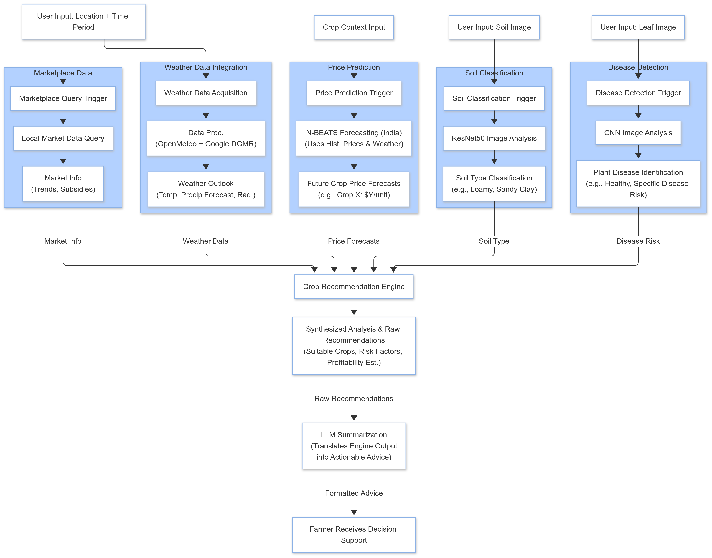
*(Caption: Conceptual flow diagram of the AI models)*

---

---

## 3. Dataset Information

The development and performance of the AI models rely heavily on diverse, high-quality datasets. The following outlines the primary data categories and sources utilized or considered for this system:

*   **Weather & Climate Data:**
    *   **Sources:** Historical weather records and forecast data were primarily accessed via the **Open-Meteo API**. Open-Meteo aggregates data from numerous reputable meteorological institutions and models, including:
        *   Global forecast systems like **ECMWF-IFS** (European Centre for Medium-Range Weather Forecasts Integrated Forecasting System).
        *   Reanalysis datasets like **ERA5** for high-quality historical context.
        *   Data from national weather services (e.g., **NOAA/NWS**, **DWD**).
    *   Additional reference sources for broader climate trends and validation include India Meteorological Department (**IMD**), National Oceanic and Atmospheric Administration (**NOAA**), and the Copernicus Climate Change Service (**C3S**).
    *   **Parameters:** Key variables include daily temperature (max/min), precipitation, solar radiation, wind speed, and weather condition codes.
    *   **Note:** While advanced localized forecasting techniques exist, the current system primarily leverages established aggregated forecast services.

*   **Crop Price & Market Data:**
    *   **Primary Source:** Historical daily market prices and arrival data for key crops (Jowar, Maize, Mango, Onion, Potato, Rice, Wheat) were primarily sourced from the Government of India's **Agmarknet** portal.
    *   **Challenges:** Acquiring and cleaning comprehensive time series data from portals like Agmarknet often involves significant effort due to variations in reporting, data formats, and download mechanisms.
    *   **Contextual Sources:** International Food and Agriculture Organization (**FAOSTAT**) and International Crops Research Institute for the Semi-Arid Tropics (**ICRISAT**) provide valuable supplementary data on broader production statistics, area harvested, and yield trends.

*   **Soil Data:**
    *   **Image Classification Dataset:** The dataset used for training the ResNet50 soil image classifier (covering types like Alluvial, Black, Cinder, etc.) was **aggregated and curated from multiple public sources**, including repositories like Kaggle and GitHub. This involved collecting images associated with different soil types, standardizing labels (recognizing that classification systems vary, e.g., ICAR defines 8 major types while USDA uses 12 orders), and ensuring visual quality.
    *   **Contextual/Future Data Layers:** Geographic soil information systems like **ISRO's BHUVAN portal**, global datasets like **SoilGrids**, and satellite imagery (e.g., **Sentinel-2**) offer potential for incorporating broader spatial soil property data, although these were not the primary input for the current image classification model.

*   **Plant Disease Data:**
    *   **Image Classification Dataset:** Images of Tomato, Potato, and Corn leaves exhibiting symptoms of Bacterial Spot, Early Blight, and Common Rust were compiled for training the disease detection CNN.
    *   **Sources:** This dataset leveraged publicly available agricultural image collections, primarily drawing from resources such as:
        *   **PlantVillage Dataset:** A well-known benchmark for plant disease imagery.
        *   Collections from agricultural research institutions (**ICAR** resources).
        *   Curated subsets from platforms like Kaggle (e.g., "New Plant Diseases Dataset" variants) and other specialized repositories focused on plant pathology.

*   **Policy & Schemes Data:**
    *   Information regarding relevant government agricultural policies, subsidies (e.g., **PM-KISAN**), and insurance schemes (e.g., **PMFBY**) is gathered from official government portals (**India.gov.in** and specific ministry websites). This data provides crucial context for the crop recommendation engine.

*   **Platform-Generated Data (Implicit User Data):**
    *   As users interact with the platform, valuable anonymized data is implicitly generated, which can continuously refine the AI models and personalization:
        *   **Image Submissions:** The collection of user-uploaded soil and leaf images can, over time, build a geographically tagged dataset reflecting real-world conditions.
        *   **Usage Patterns:** Anonymized data on which forecasts or crop recommendations users view or act upon can help assess model relevance and guide future improvements.
        *   **Marketplace Activity (if applicable):** Anonymized transaction data related to seeds, tools, or crop sales within the platform's marketplace can offer real-time insights into local supply, demand, and price dynamics, potentially supplementing external market data.

The effective integration and cleaning of data from these diverse sources are critical steps in building robust and reliable AI components for the agricultural intelligence system.

---

## 4. Methodology and AI Components

### 4.1 Weather Data Integration and Analysis

Weather is a fundamental driver of agricultural outcomes. This module focuses on acquiring and structuring relevant weather data for use by other AI components, particularly price prediction.

*   **Data Requirements:** Key parameters include daily maximum/minimum temperatures, precipitation totals, solar radiation (shortwave), wind speed, and general weather condition codes. Both historical records aligned with price data and future forecasts covering the prediction horizon are necessary.
*   **Processing:** Data is cleaned, standardized (units, names), and resampled to a consistent daily frequency. Missing values are imputed using appropriate methods (e.g., temporal filling for temperature, statistical defaults for radiation).
*   **Role in Pipeline:** Provides historical weather as *past covariates* for training time series models and future weather estimates as *future covariates* during the prediction phase. The quality of weather data directly impacts the accuracy of downstream models like price prediction.

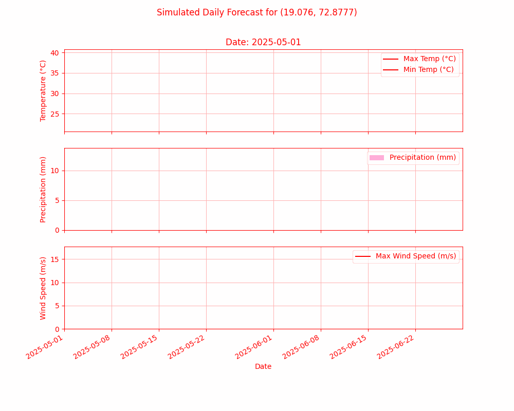
*(Caption: Conceptual animation illustrating the flow of data and prediction over time.)*

### 4.2 Crop Price Prediction using N-BEATS

Predicting volatile crop prices helps farmers make informed decisions about planting and selling. The N-BEATS (Neural Basis Expansion Analysis for Time Series Forecasting) model was selected for this task.

*   **Rationale:** N-BEATS is a deep learning model specifically designed for time series forecasting. It has shown strong performance on various benchmarks. Its architecture, based on backward and forward residual links and basis expansion, allows it to model complex patterns like trend and seasonality inherently. Crucially, its "generic" architecture variant readily incorporates external factors (covariates) like weather data, which significantly influence crop prices.
*   **Methodology:**
    *   **Input:** Historical daily price data for a specific crop (target series) and corresponding historical daily weather data (past covariates).
    *   **Preprocessing:** Both price and weather data are scaled (typically to a 0-1 range) before being fed into the model. This normalization is essential for stable neural network training. Scalers are saved to reverse the process after prediction.
    *   **Training:** The model learns patterns by looking back at a defined window of past data (`input_chunk_length`, e.g., 90 days) to predict a future window (`output_chunk_length`, e.g., 16 days). It's trained using an optimization algorithm (e.g., AdamW) to minimize a loss function like Mean Absolute Error (MAE) between its predictions and the actual prices in the training set. A validation set is used to monitor performance and prevent overfitting, often employing techniques like learning rate scheduling and early stopping. The best performing model based on validation loss is saved.
    *   **Prediction:** To forecast future prices, the model requires the most recent historical price data (scaled) and *both* historical and *future* weather data (scaled) as covariates, extending across the desired forecast period (`N_DAYS_PREDICT`). The model then autoregressively generates the forecast, which is subsequently inverse-scaled back to the original price units.
*   **Output:** A time series forecast of daily prices for the specified crop and location over the prediction horizon.

*Training & Forecast Examples:*
| Crop      | Training History Plot                          | Forecast Plot                               |
| :-------- | :--------------------------------------------- | :------------------------------------------ |
| Jowar     | 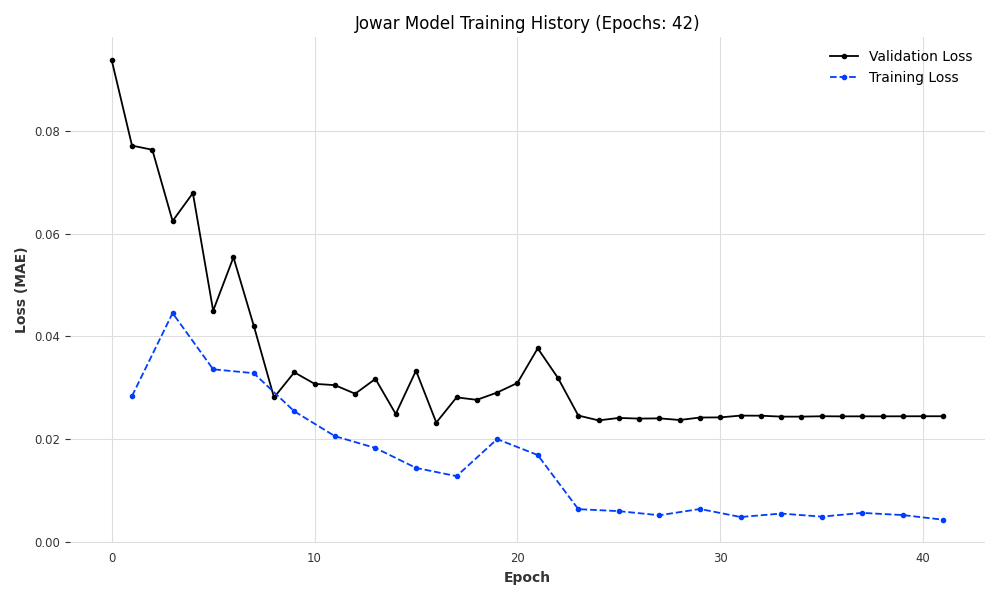   | 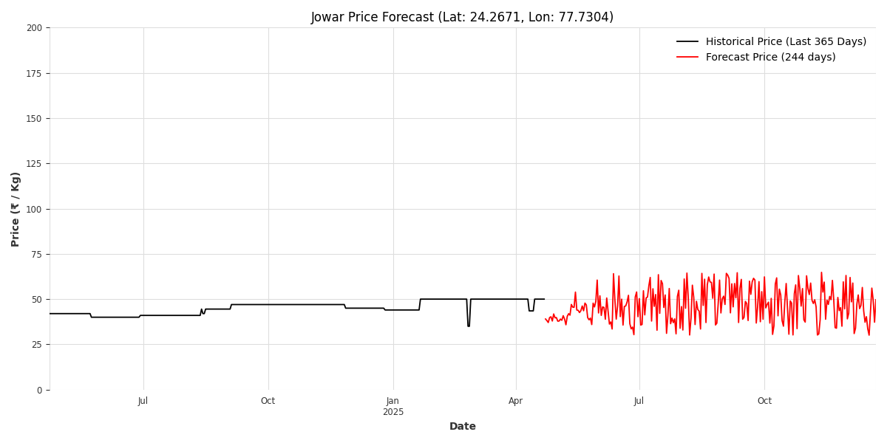 |
| Maize     | 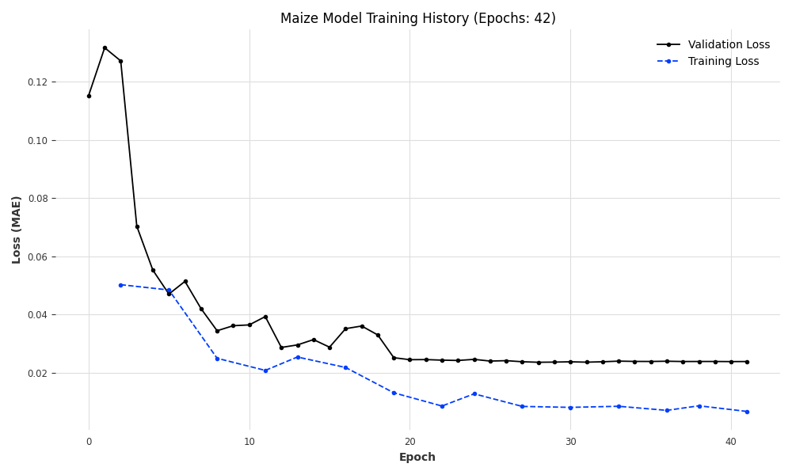   | 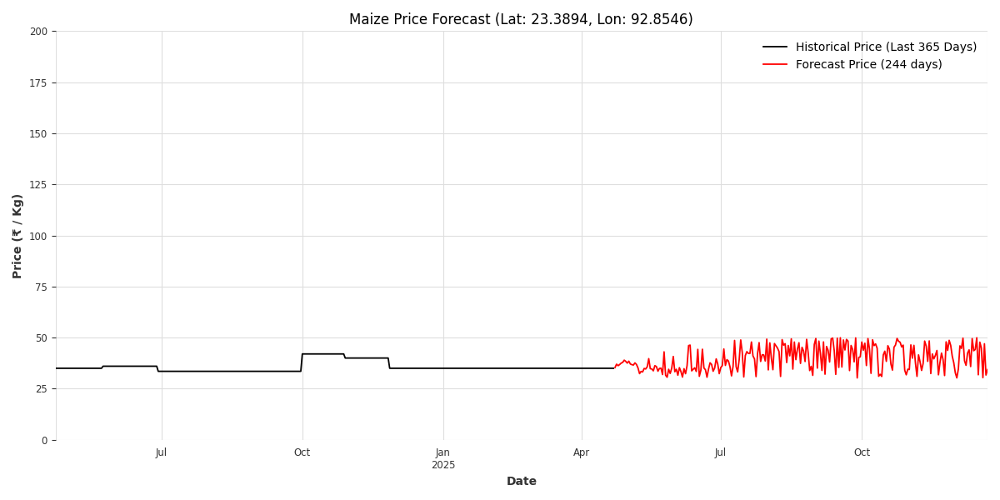 |
| Mango     | 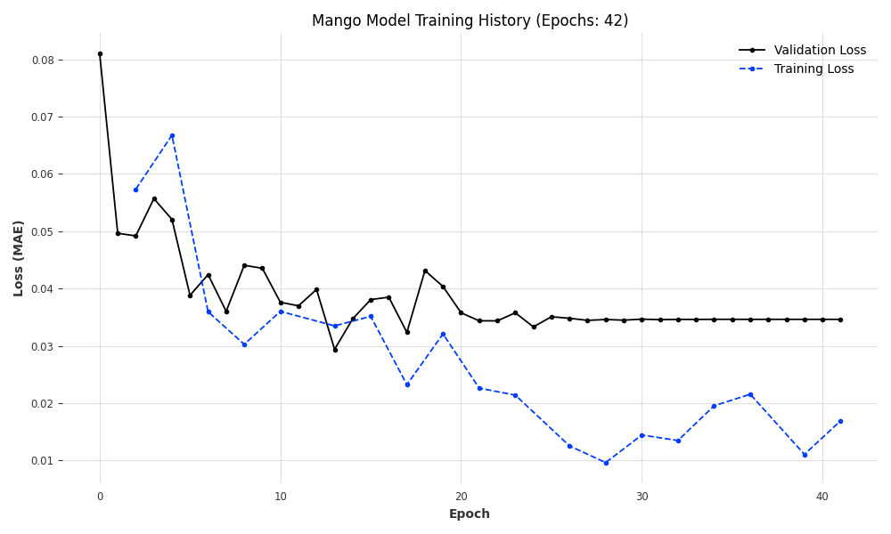   | 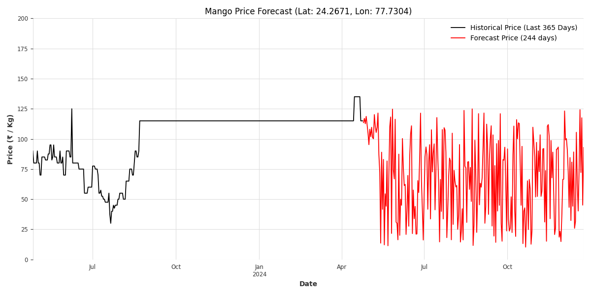 |
| Onion     | 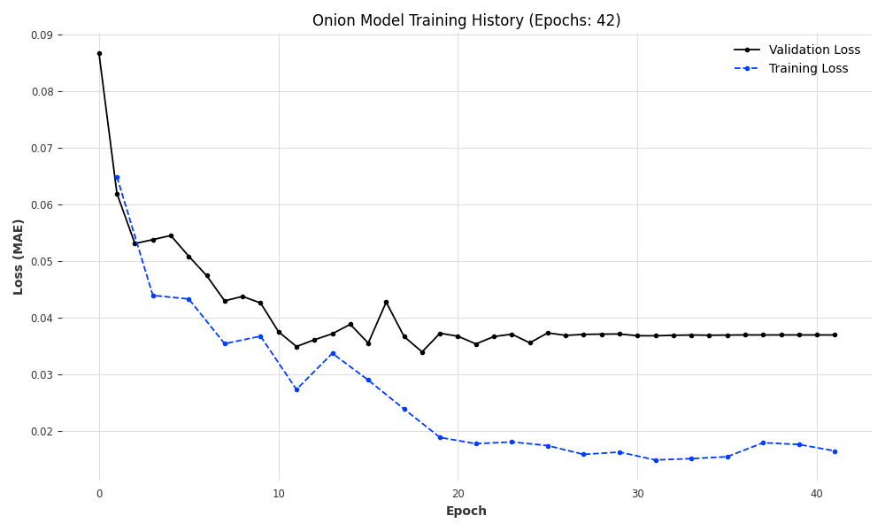   | 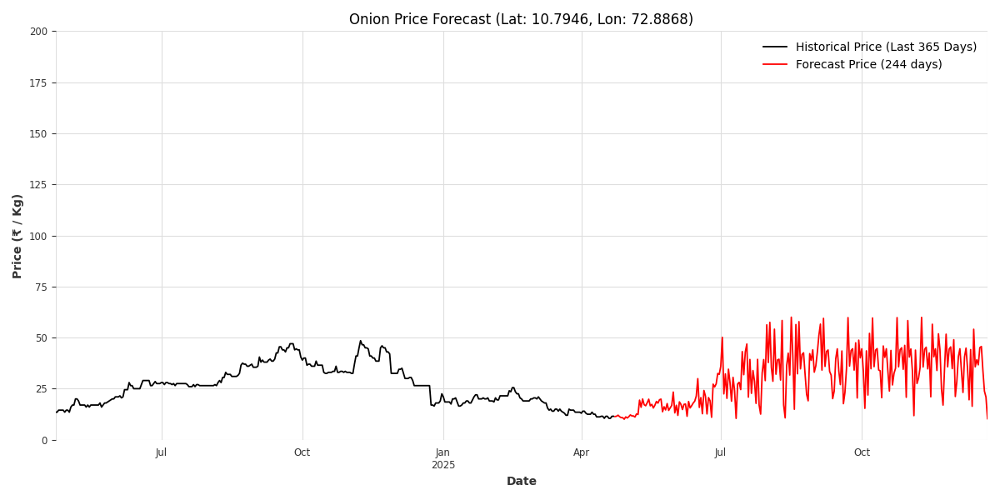 |
| Potato    | 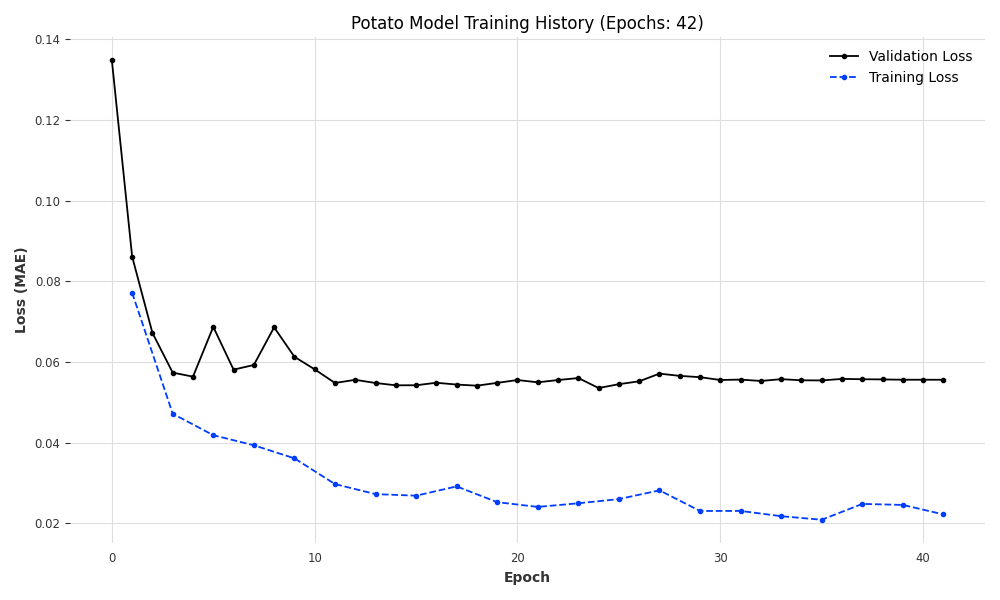 | 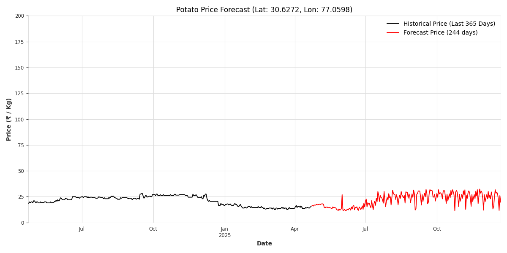|
| Rice      | 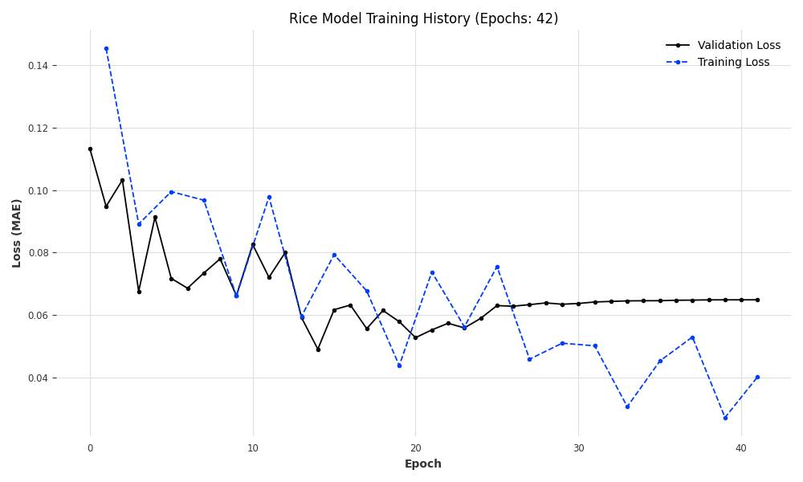     | 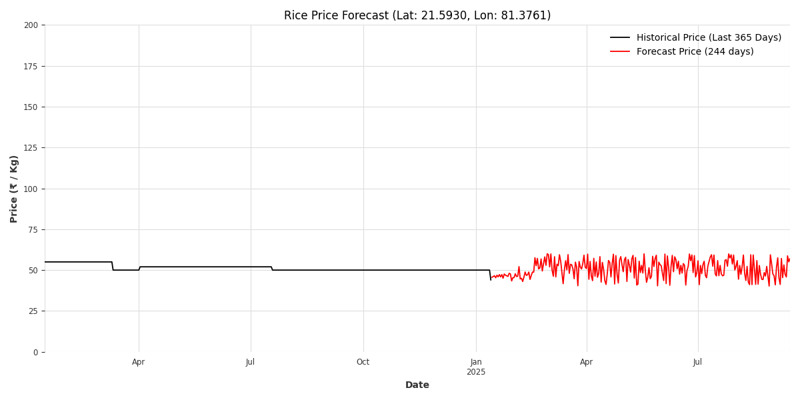   |
| Wheat     | 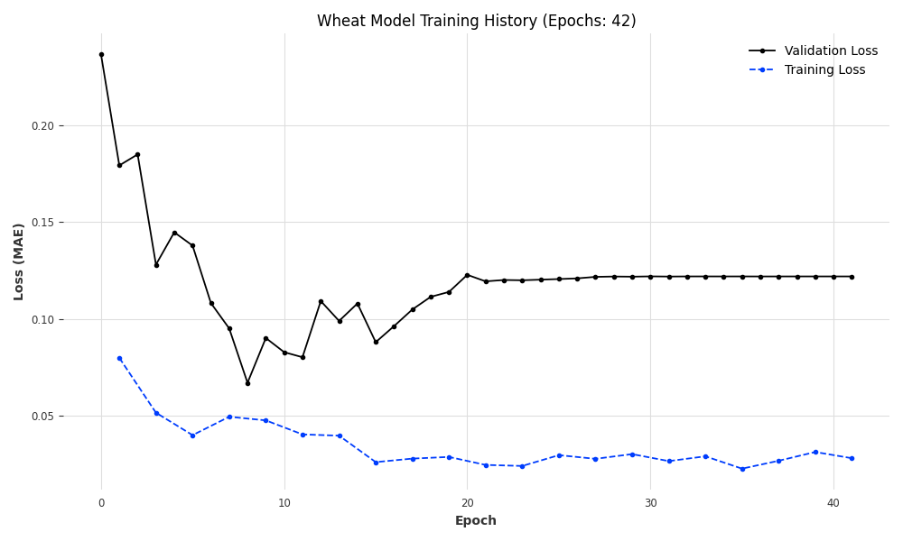   | 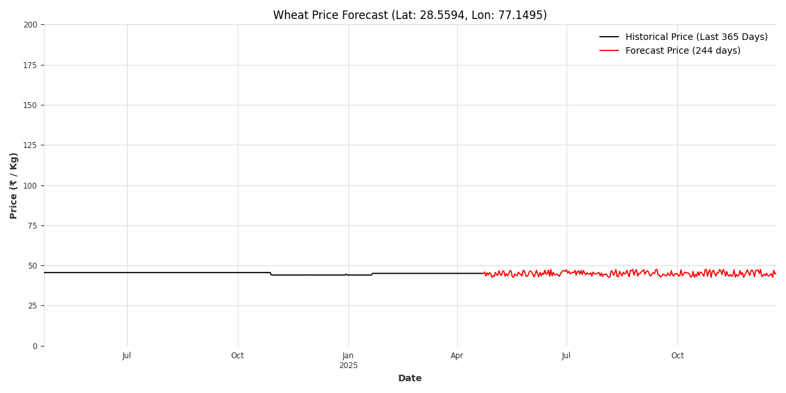 |

*(Caption: Example training loss curves and forecast results for various crops using the N-BEATS model.)*

### 4.3 Soil Classification using ResNet50

Understanding soil type is crucial for selecting appropriate crops and managing nutrients. A deep learning approach using a Convolutional Neural Network (CNN), specifically ResNet50, was chosen for image-based soil classification.

*   **Rationale:** ResNet50 is a deep CNN architecture known for its effectiveness in image recognition tasks. Its residual connections help mitigate the vanishing gradient problem, allowing for very deep networks. By using a ResNet50 model pre-trained on a large dataset like ImageNet, we leverage *transfer learning*. The pre-trained layers act as powerful generic feature extractors (detecting edges, textures, shapes), which can be adapted to the specific task of soil classification with relatively less training data and time compared to training from scratch.
*   **Methodology:**
    *   **Input:** Digital images of soil samples.
    *   **Preprocessing:** Images are resized to a consistent input size (e.g., 224x224 pixels, standard for ResNet). Normalization (adjusting pixel values to a standard range, often using ImageNet's mean and standard deviation) is applied. During training, *data augmentation* techniques (random flips, rotations, color jitter, cropping) are used to artificially increase the diversity of the training set and make the model more robust to variations in lighting and perspective.
    *   **Model Architecture:** The pre-trained ResNet50 base is used as a feature extractor. Its final classification layer is removed and replaced with a custom head suitable for the number of soil classes in our dataset. This head typically includes one or more fully connected layers with dropout (to prevent overfitting) and a final softmax layer to output probabilities for each soil class.
    *   **Training:** The model (often primarily the custom head, sometimes fine-tuning earlier layers) is trained on the labeled soil image dataset using a suitable loss function (e.g., Cross-Entropy Loss) and optimizer (e.g., AdamW). Validation data helps tune hyperparameters and select the best model checkpoint.
*   **Output:** Probabilities for each predefined soil class, with the highest probability indicating the predicted soil type.

*Training & Evaluation Visualization:*
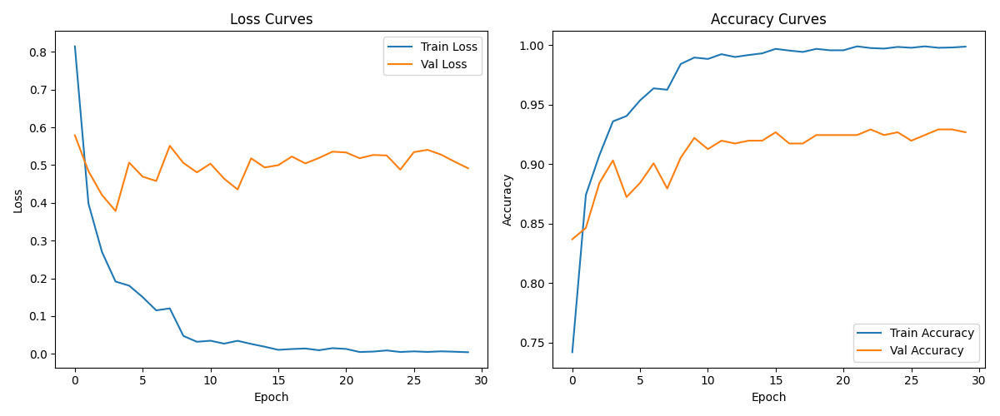
*(Caption: Training and validation accuracy/loss curves for the ResNet50 soil classifier.)*

### 4.4 Plant Disease Detection using CNN

Early detection of plant diseases can significantly reduce crop losses. This module uses a custom-trained Convolutional Neural Network (CNN) to identify diseases from leaf images.

*   **Rationale:** CNNs excel at learning hierarchical patterns directly from pixel data, making them ideal for visual recognition tasks like identifying disease symptoms (lesions, spots, rusts) on plant leaves. Unlike traditional image processing, CNNs learn the relevant features automatically during training. While pre-trained models could be used, training a custom CNN allows tailoring the architecture specifically to the visual characteristics of the target diseases and available dataset.
*   **Methodology:**
    *   **Input:** Digital images of plant leaves (Tomato, Potato, Corn).
    *   **Preprocessing:** Similar to soil classification, images are resized (e.g., 256x256), and pixel values are normalized (e.g., scaled to 0-1). Data augmentation during training is vital to handle variations in lighting, angle, and symptom presentation.
    *   **Model Architecture:** A typical CNN architecture is employed, consisting of stacked `Conv2D` layers (using activation functions like ReLU to introduce non-linearity) and `MaxPooling2D` layers (to reduce spatial dimensions and provide some translation invariance). The convolutional layers extract increasingly complex features. These are followed by a `Flatten` layer and one or more `Dense` (fully connected) layers culminating in a `softmax` output layer that provides probabilities for each plant-disease class.
    *   **Training:** The model is trained on labeled leaf images using `categorical_crossentropy` loss and an optimizer like Adam. Performance is monitored on a validation set.
*   **Output:** Probabilities for each predefined plant-disease combination (e.g., 'Potato-Early_blight'), allowing identification of the most likely issue.

*Training & Example Prediction:*
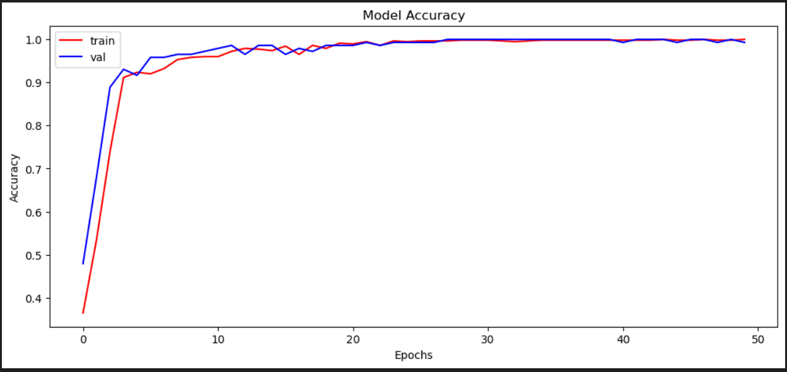
*(Caption: Training and validation accuracy/loss curves for the plant disease detection CNN.)*

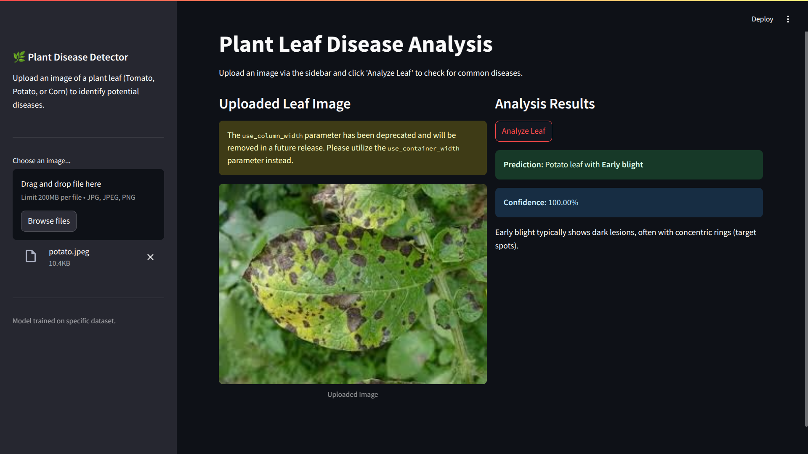
*(Caption: Example of a user interface element showing an input leaf image and the model's disease prediction.)*

### 4.5 Crop Recommendation Engine [Placeholder]

This core component integrates insights from the specialized AI modules to provide tailored crop recommendations.

*   **Objective:** To suggest the most suitable crops for a farmer based on predicted weather, expected market prices, identified soil type, potential disease risks, and potentially other factors like subsidies and market access facilitated by the platform.
*   **Methodology:** [**Placeholder: This section will be detailed by the team member responsible for the recommendation engine. It should cover the logic (e.g., rule-based system, constraint satisfaction, ML model like collaborative filtering or reinforcement learning), the specific inputs used, how they are weighted/combined, and the nature of the output recommendations.**]
*   **Example Inputs:** Favorable long-term weather forecast, high predicted price for Maize, identified Loamy soil, low risk of common corn diseases.
*   **Example Output:** Recommendation: "Maize is highly recommended due to favorable price forecasts and suitability for your loamy soil. Expected weather patterns are also conducive. Monitor for [specific low-risk disease] as a precaution."

### 4.6 Output Summarization using LLM (Conceptual)

To ensure recommendations are easily understood, the final output can be processed by a Large Language Model (LLM).

*   **Rationale:** LLMs can synthesize complex data points and present them in natural, conversational language. This bridges the gap between quantitative model outputs and actionable advice for farmers who may not be data science experts.
*   **Process:** The structured recommendations and key supporting factors (e.g., "High price forecast for Wheat," "Soil type: Black," "Risk of Early Blight detected in Potato sample") from the recommendation engine are fed into an LLM (e.g., Gemma) via a carefully crafted prompt. The prompt instructs the LLM to generate a concise summary explaining the recommendations and the primary reasons behind them.
*   **Output:** A user-friendly text summary delivered through the application interface.

---

## 5. Results Summary

The implemented AI modules demonstrated promising results during evaluation:

*   **Soil Classification (ResNet50):** Achieved a test accuracy of **[Insert Accuracy from `resnet50eval.py` output, e.g., 9X.XX%]**. The confusion matrix (Figure: Soil Confusion Matrix) indicates strong performance across most classes, with some potential confusion between visually similar types [**Optionally mention specific confusions if significant**].
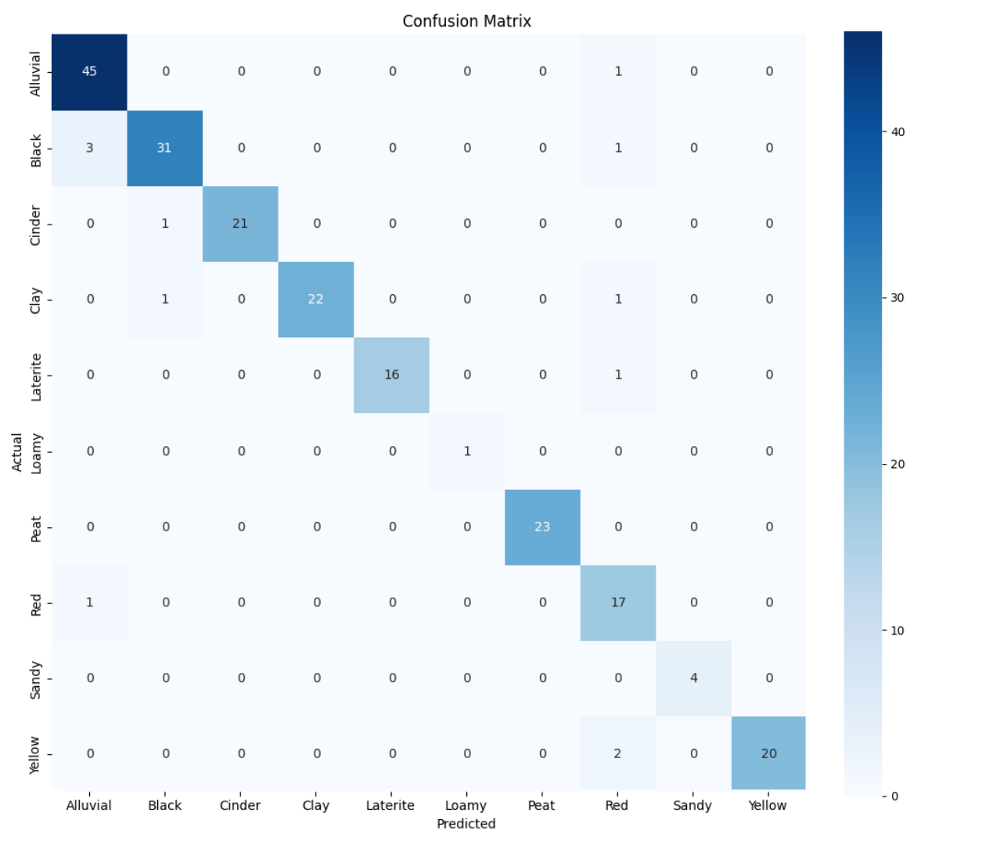
*(Caption: Confusion matrix visualizing the performance of the soil classifier on the test set, showing correct and incorrect predictions per class.)*

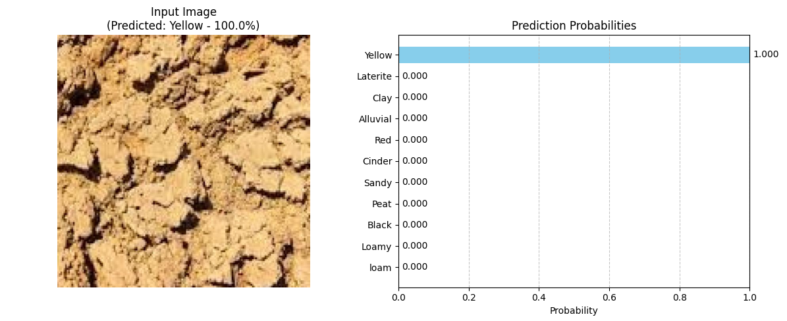
*(Caption: Example soil image input and the corresponding classification output.)*
*   **Plant Disease Detection (CNN):** Reached a test accuracy of **[Insert Accuracy from `train.py` output, e.g., 9Y.YY%]** on the specific diseases included in the dataset.
*   **Crop Price Prediction (N-BEATS):** Validation loss during training indicated successful learning of price dynamics influenced by weather patterns. Qualitative assessment of forecast plots (Figures provided in Sec 4.2) shows the model captures trends and seasonality for various crops.

Quantitative evaluation of the end-to-end crop recommendation accuracy is pending the full implementation and testing of the Recommendation Engine module.

---

## 6. Conclusion and Future Work

This report has outlined the AI-driven components of an agricultural intelligence platform. By leveraging deep learning for image analysis (soil, disease) and time series forecasting (price prediction) informed by weather data, the system provides valuable inputs for intelligent crop planning. The modular architecture allows for continuous improvement and integration of diverse data sources.

**Future Directions:**

*   **Implement & Evaluate Recommendation Engine:** Develop and rigorously test the core crop recommendation logic using historical data and farmer feedback.
*   **LLM Integration & User Experience:** Integrate the chosen LLM for output summarization and refine the presentation of information within the user interface based on usability testing.
*   **Model Enhancement:** Explore more advanced architectures (e.g., Vision Transformers for images, Transformer-based models for time series), hyperparameter optimization, and ensemble methods to boost accuracy.
*   **Data Enrichment:** Incorporate additional data layers like satellite imagery, soil nutrient data, pest infestation reports, and real-time market feeds.
*   **Weather Model Advancement:** Integrate or develop more sophisticated, localized weather forecasting models (potentially leveraging research in areas like PySteps/DGMR) for higher accuracy input.
*   **Scope Expansion:** Increase the number of supported crops, diseases, and soil types based on regional needs and data availability.

The continued development of this AI system aims to provide increasingly accurate, comprehensive, and accessible decision support tools for farmers, contributing to more efficient and sustainable agricultural practices.
